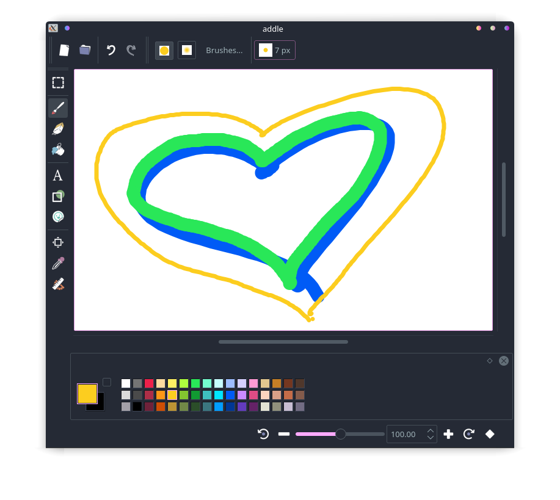

# Addle

Addle is a lightweight graphical application for drawing, editing and viewing images, as well as various other image-related tasks. It is written in C++ with Qt.

**This project is currently very early in development.** Its design, features, and support will be subject to adjustment and many things may change considerably between now and release.

## Features

> Demo of Addle's GUI, (on KDE Plasma, using the Breeze style)

Addle will be a dual-purpose image viewer and image editor, providing a modest set of features to both ends. This includes that Addle should load quickly and maintain a conservative memory footprint to perform well as an image viewer.

The editing functionality will emphasize a streamlined workflow for common and simple image editing tasks, such as resizing and cropping, annotating, and I/O via the clipboard. Specific features will include some basic raster drawing tools (e.g., paintbrush, eraser, fill bucket), some basic vector drawing tools (e.g., shapes, text entry), and basic filters (e.g., HLS adjust, gaussian blur, etc.). Multi-layer images and transparency will be supported.

Both editing and viewing will use a freely panning/zooming/rotating viewport, and offer a selection tool for copying image data to the clipboard.

A few other I/O features are intended or under consideration, including screen capture and capture from a web browser. 

At some point, Addle's editor may be extended for animation. This is a desired feature, but not a prioritized one.

Addle's features will also be extensible via plugins, using a Python API.

## Platforms

Support is currently prioritized for desktop Linux and Windows.

Hopefully, in the future support can be extended to OS X and other desktop systems supported by Qt. A mobile-optimized UI, with support for Android, iOS, and other mobile operating systems is also on the table, but will be a low priority for the time being. A version of Addle for web (via wasm) is also on the table but low priority. Addle being lightweight, some degree of support may be extended to embedded or legacy systems (insofar as such support might be useful).
## Contribution

The official repository is on GitHub at https://github.com/squeevee/Addle

Currently (April 2020), the code base is prone to large refactors. After the completion of the ["Pilot implementation"](https://github.com/squeevee/Addle/milestone/1) (i.e., proof-of-design prototype), I should know better what I'm doing and things should be more stable going forward. In case anyone happens to be interested in contributing, it might be easier after that point.

## License

The source code for Addle is available under the terms of the MIT license.